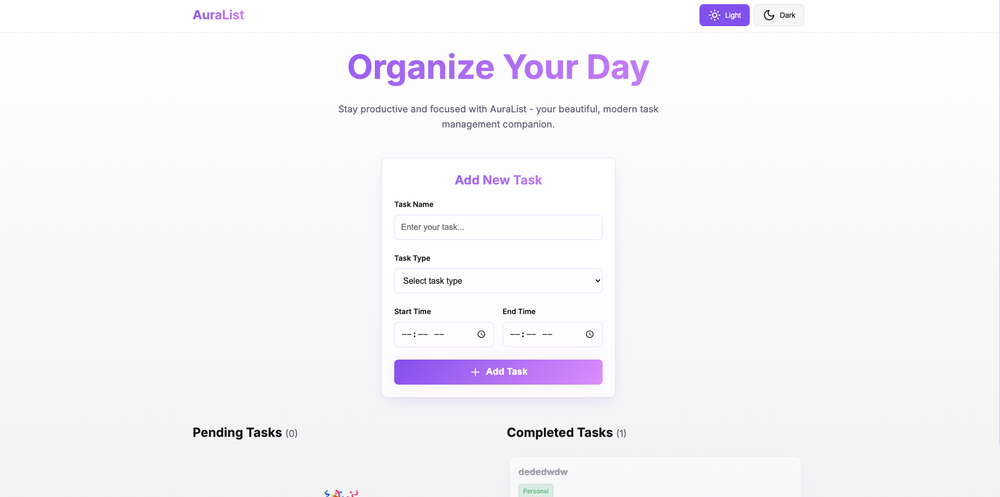
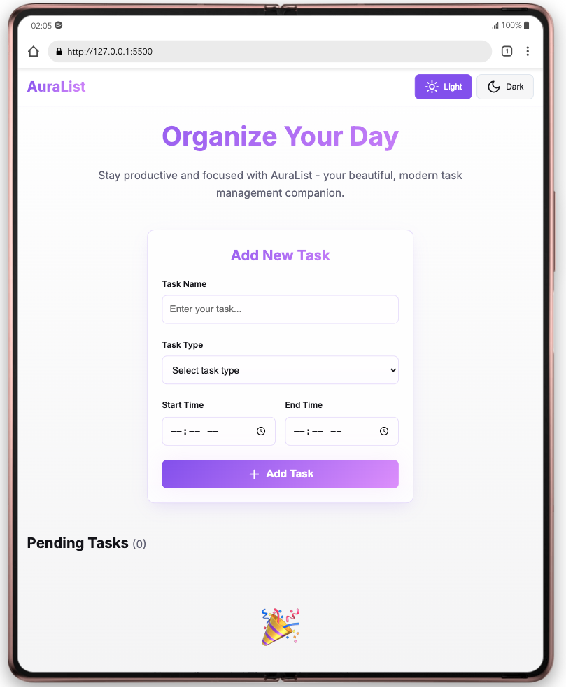
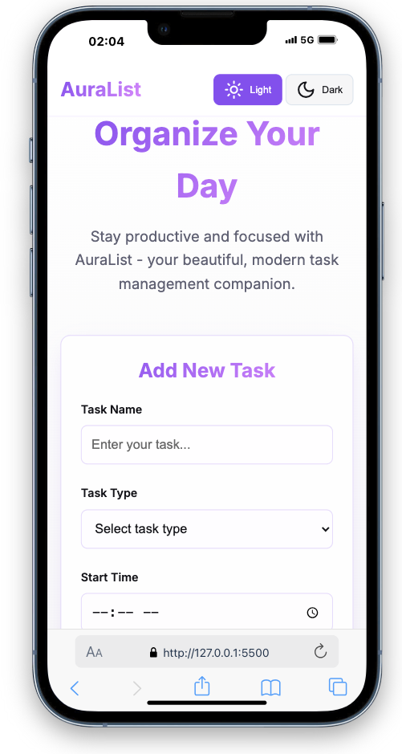

# 📝 AuraList – Modern To-Do List Web Application

AuraList is a sleek, responsive, and modern to-do list web application that helps users manage their daily tasks with clarity and efficiency. Built with HTML, CSS, and JavaScript, it supports dark/light themes, task categorization, and real-time task management.

---

## 🚀 Features

- ✅ Add tasks with:
  - Task Name
  - Task Type (Work, Personal, Study, Exercise, etc.)
  - Start Time
  - End Time
- 🎨 Color-coded task types for quick identification
- 🌗 Dark/Light mode toggle
- 🗂 Task management:
  - Mark tasks as **complete**
  - **Delete** tasks
- 🖥️ Fully responsive design for mobile, tablet, and desktop
- 💾 (Optional) Local storage to persist tasks across reloads

---

## 📸 Screenshot (DESKTOP-VIEW)

## 📸 Screenshot (TABLET-VIEW)

## 📸 Screenshot (Mobile-VIEW)

---

## 🛠️ Tech Stack

- HTML5
- CSS3 (Flexbox & Responsive Design)
- JavaScript (Vanilla JS)

---

## 📁 Folder Structure

auralist/
│
├── index.html
├── styles.css
├── index.js  
└── README.md

## ⚙️ Getting Started

To run this project locally:

1. Clone the repository:

   git clone https://github.com/karim-kodes/codealpha-tasks.git

2.Navigate to the project folder:

    cd auralist

✨ Usage
Enter a task name.

Choose a task type from the dropdown.

Select start and end time.

Click Add Task.

Use the Complete button to mark tasks as done.

Use the Delete button to remove tasks.

Toggle between light and dark mode using the theme switcher.

🎨 Task Type Colors
Task Type Color
Work Blue
Personal Green
Study Teal
Exercise Yellow

📌 Future Enhancements
Edit tasks

Drag and drop to reorder

Due date reminders

Task categories and filters

Login/authentication

Data persistence with backend or Firebase

📄 License
This project is licensed under the MIT License.

🙌 Acknowledgements
Inspired by modern productivity tools

Built for educational and portfolio use

💡 Author
Abdikarim Mohamed Abdi
